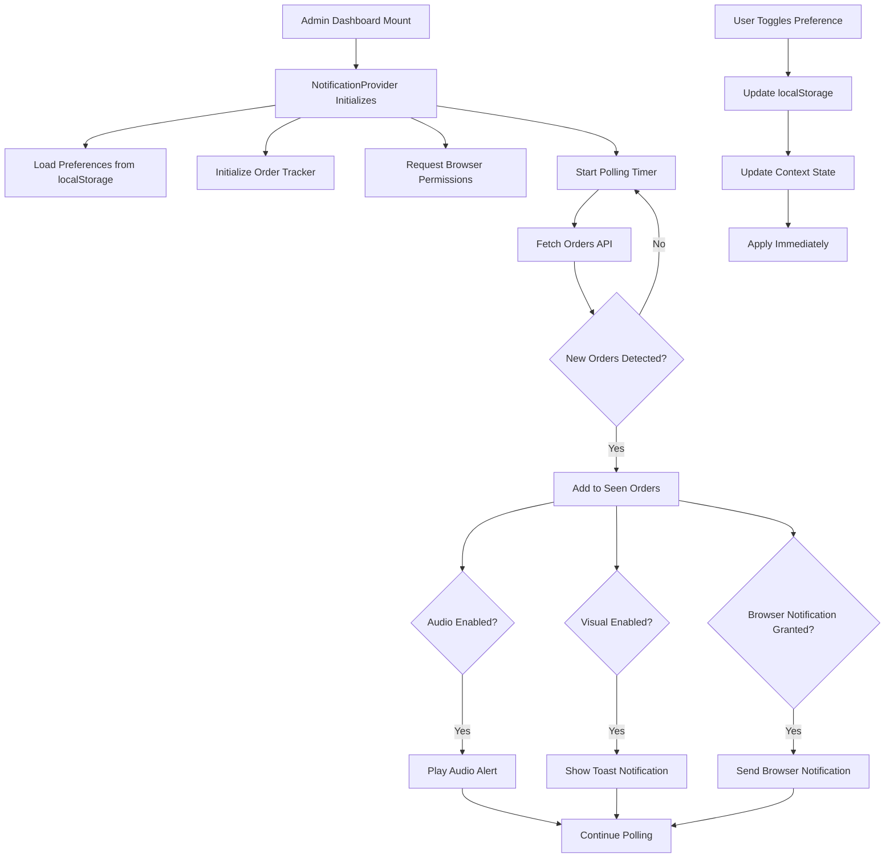
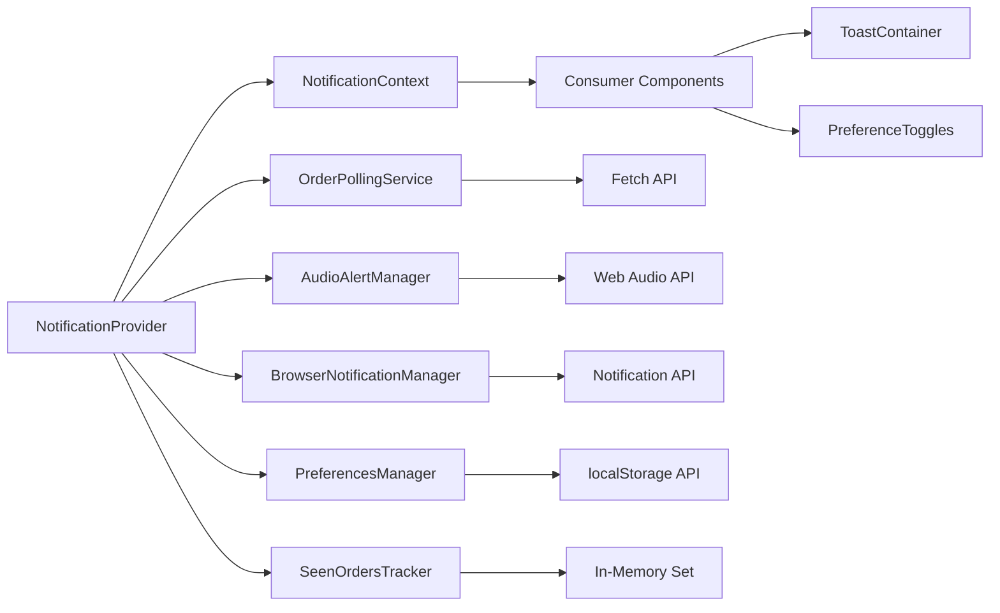

# Design Document: Admin Order Notification System

## Overview

The Admin Order Notification System is a client-side notification framework that alerts administrators of new orders through multiple channels: visual toast notifications, audio alerts, and native browser notifications. The system is designed with strict SSR safety to prevent React hydration errors, operates entirely on the client side, and provides resilient, real-time order detection through polling.

### Key Design Goals

1. **SSR Safety First**: All notification components must be client-only with no server-side rendering
2. **Multi-Channel Alerts**: Visual, audio, and browser notifications work independently
3. **Graceful Degradation**: Individual component failures do not affect other notification channels
4. **Zero Duplicates**: Session-based order tracking prevents repeated notifications
5. **User Control**: Administrators can customize notification preferences via localStorage
6. **React Hydration Safety**: No window/document access during SSR; all browser APIs accessed post-mount

### Technical Context

- **Framework**: Next.js 14 (App Router)
- **State Management**: React hooks (useState, useEffect, useRef, useContext)
- **Client-Side Only**: 'use client' directive required for all notification components
- **Storage**: localStorage for preferences, in-memory for order tracking
- **APIs**: Web Audio API, Notification API, Fetch API

## Architecture

### High-Level Component Hierarchy

```
AdminDashboardPage (Server Component)
  └── NotificationProvider (Client Component)
        ├── useOrderPolling (Custom Hook)
        ├── useAudioAlert (Custom Hook)
        ├── useBrowserNotification (Custom Hook)
        ├── useNotificationPreferences (Custom Hook)
        └── ToastContainer (Client Component)
              └── Toast (Client Component)
```

### Data Flow Architecture



### Component Architecture Diagram



## Components and Interfaces

### 1. NotificationProvider Component

**Purpose**: Root client component that orchestrates all notification functionality and provides context to children.

**Type Definition**:
```typescript
interface NotificationProviderProps {
  children: React.ReactNode;
  branchId: string;
  initialOrders?: Order[];
}

interface NotificationContextValue {
  preferences: NotificationPreferences;
  updatePreferences: (prefs: Partial<NotificationPreferences>) => void;
  clearNotifications: () => void;
  newOrderCount: number;
}

export function NotificationProvider(props: NotificationProviderProps): JSX.Element;
```

**Key Responsibilities**:
- Render only on client (requires 'use client' directive)
- Initialize all sub-managers (audio, browser notification, polling)
- Provide notification context to child components
- Coordinate between different notification channels
- Handle component lifecycle (mount/unmount)

**SSR Safety Pattern**:
```typescript
'use client';

export function NotificationProvider({ children, branchId }: NotificationProviderProps) {
  const [mounted, setMounted] = useState(false);
  
  useEffect(() => {
    setMounted(true);
  }, []);
  
  if (!mounted) {
    return <>{children}</>;
  }
  
  // Browser API access only after mounted
  // ...
}
```

### 2. useOrderPolling Hook

**Purpose**: Custom hook that polls the orders API and detects new orders.

**Type Definition**:
```typescript
interface UseOrderPollingOptions {
  branchId: string;
  intervalMs: number; // 15000-30000
  enabled: boolean;
  onNewOrders: (orders: Order[]) => void;
}

interface UseOrderPollingReturn {
  orders: Order[];
  isPolling: boolean;
  error: Error | null;
  lastPollTime: Date | null;
}

function useOrderPolling(options: UseOrderPollingOptions): UseOrderPollingReturn;
```

**Implementation Strategy**:
```typescript
function useOrderPolling({ branchId, intervalMs, enabled, onNewOrders }: UseOrderPollingOptions) {
  const [orders, setOrders] = useState<Order[]>([]);
  const [isPolling, setIsPolling] = useState(false);
  const [error, setError] = useState<Error | null>(null);
  const [lastPollTime, setLastPollTime] = useState<Date | null>(null);
  const seenOrderIds = useRef<Set<string>>(new Set());
  
  useEffect(() => {
    if (!enabled) return;
    
    const poll = async () => {
      setIsPolling(true);
      try {
        const response = await fetch(`/api/admin/orders?branchId=${branchId}&limit=20`);
        if (!response.ok) throw new Error('Polling failed');
        
        const data = await response.json();
        const fetchedOrders = data.orders || [];
        
        // Detect new orders
        const newOrders = fetchedOrders.filter((order: Order) => 
          !seenOrderIds.current.has(order.id)
        );
        
        // Update seen orders
        newOrders.forEach((order: Order) => {
          seenOrderIds.current.add(order.id);
        });
        
        if (newOrders.length > 0) {
          onNewOrders(newOrders);
        }
        
        setOrders(fetchedOrders);
        setLastPollTime(new Date());
        setError(null);
      } catch (err) {
        setError(err as Error);
        console.error('Order polling error:', err);
      } finally {
        setIsPolling(false);
      }
    };
    
    // Initial poll
    poll();
    
    // Set up interval
    const intervalId = setInterval(poll, intervalMs);
    
    return () => clearInterval(intervalId);
  }, [branchId, intervalMs, enabled, onNewOrders]);
  
  return { orders, isPolling, error, lastPollTime };
}
```

**Key Features**:
- Uses useRef to maintain seen order set across renders
- Cleanup on unmount prevents memory leaks
- Error handling with retry on next interval
- Configurable polling interval (15-30s range)

### 3. useAudioAlert Hook

**Purpose**: Manages audio notification playback using Web Audio API.

**Type Definition**:
```typescript
interface UseAudioAlertOptions {
  enabled: boolean;
  frequency?: number; // Default: 800Hz
  duration?: number; // Default: 500ms
  volume?: number; // Default: 0.3
}

interface UseAudioAlertReturn {
  playAlert: () => void;
  isSupported: boolean;
  error: Error | null;
}

function useAudioAlert(options: UseAudioAlertOptions): UseAudioAlertReturn;
```

**Implementation Strategy**:
```typescript
function useAudioAlert({ enabled, frequency = 800, duration = 500, volume = 0.3 }: UseAudioAlertOptions) {
  const [isSupported, setIsSupported] = useState(false);
  const [error, setError] = useState<Error | null>(null);
  const audioContextRef = useRef<AudioContext | null>(null);
  
  useEffect(() => {
    // Check browser support
    if (typeof window !== 'undefined') {
      setIsSupported('AudioContext' in window || 'webkitAudioContext' in (window as any));
    }
    
    return () => {
      // Cleanup audio context
      if (audioContextRef.current) {
        audioContextRef.current.close();
      }
    };
  }, []);
  
  const playAlert = useCallback(() => {
    if (!enabled || !isSupported) return;
    
    try {
      // Create audio context lazily
      if (!audioContextRef.current) {
        audioContextRef.current = new (window.AudioContext || (window as any).webkitAudioContext)();
      }
      
      const ctx = audioContextRef.current;
      const oscillator = ctx.createOscillator();
      const gainNode = ctx.createGain();
      
      oscillator.connect(gainNode);
      gainNode.connect(ctx.destination);
      
      oscillator.frequency.value = frequency;
      oscillator.type = 'sine';
      
      gainNode.gain.setValueAtTime(volume, ctx.currentTime);
      gainNode.gain.exponentialRampToValueAtTime(0.01, ctx.currentTime + duration / 1000);
      
      oscillator.start(ctx.currentTime);
      oscillator.stop(ctx.currentTime + duration / 1000);
      
      setError(null);
    } catch (err) {
      setError(err as Error);
      console.error('Audio alert error:', err);
    }
  }, [enabled, isSupported, frequency, duration, volume]);
  
  return { playAlert, isSupported, error };
}
```

**Key Features**:
- Lazy initialization of AudioContext
- Graceful degradation if Web Audio API unsupported
- Configurable sound parameters
- Cleanup prevents resource leaks

### 4. useBrowserNotification Hook

**Purpose**: Manages native browser notifications with permission handling.

**Type Definition**:
```typescript
interface UseBrowserNotificationOptions {
  enabled: boolean;
  autoRequestPermission?: boolean;
}

interface UseBrowserNotificationReturn {
  sendNotification: (title: string, options: NotificationOptions) => void;
  permission: NotificationPermission;
  requestPermission: () => Promise<NotificationPermission>;
  isSupported: boolean;
}

function useBrowserNotification(options: UseBrowserNotificationOptions): UseBrowserNotificationReturn;
```

**Implementation Strategy**:
```typescript
function useBrowserNotification({ enabled, autoRequestPermission = true }: UseBrowserNotificationOptions) {
  const [permission, setPermission] = useState<NotificationPermission>('default');
  const [isSupported, setIsSupported] = useState(false);
  
  useEffect(() => {
    if (typeof window !== 'undefined' && 'Notification' in window) {
      setIsSupported(true);
      setPermission(Notification.permission);
      
      if (autoRequestPermission && Notification.permission === 'default') {
        Notification.requestPermission().then(setPermission);
      }
    }
  }, [autoRequestPermission]);
  
  const requestPermission = useCallback(async () => {
    if (!isSupported) return 'denied';
    const result = await Notification.requestPermission();
    setPermission(result);
    return result;
  }, [isSupported]);
  
  const sendNotification = useCallback((title: string, options: NotificationOptions) => {
    if (!enabled || !isSupported || permission !== 'granted') return;
    
    try {
      const notification = new Notification(title, {
        ...options,
        requireInteraction: false,
      });
      
      // Auto-close after 10 seconds
      setTimeout(() => notification.close(), 10000);
      
      notification.onclick = () => {
        window.focus();
        notification.close();
      };
    } catch (err) {
      console.error('Browser notification error:', err);
    }
  }, [enabled, isSupported, permission]);
  
  return { sendNotification, permission, requestPermission, isSupported };
}
```

**Key Features**:
- Permission state management
- Auto-request on mount (configurable)
- Click handler to focus window
- Auto-close timeout

### 5. useNotificationPreferences Hook

**Purpose**: Manages user preferences with localStorage persistence.

**Type Definition**:
```typescript
interface NotificationPreferences {
  audioEnabled: boolean;
  visualEnabled: boolean;
  browserNotificationEnabled: boolean;
}

interface UseNotificationPreferencesReturn {
  preferences: NotificationPreferences;
  updatePreferences: (update: Partial<NotificationPreferences>) => void;
  resetPreferences: () => void;
}

function useNotificationPreferences(): UseNotificationPreferencesReturn;
```

**Implementation Strategy**:
```typescript
const DEFAULT_PREFERENCES: NotificationPreferences = {
  audioEnabled: true,
  visualEnabled: true,
  browserNotificationEnabled: true,
};

const STORAGE_KEY = 'admin-notification-preferences';

function useNotificationPreferences(): UseNotificationPreferencesReturn {
  const [preferences, setPreferences] = useState<NotificationPreferences>(DEFAULT_PREFERENCES);
  const [mounted, setMounted] = useState(false);
  
  // Load from localStorage on mount
  useEffect(() => {
    setMounted(true);
    
    if (typeof window === 'undefined') return;
    
    try {
      const stored = localStorage.getItem(STORAGE_KEY);
      if (stored) {
        const parsed = JSON.parse(stored);
        setPreferences({ ...DEFAULT_PREFERENCES, ...parsed });
      }
    } catch (err) {
      console.error('Failed to load preferences:', err);
    }
  }, []);
  
  const updatePreferences = useCallback((update: Partial<NotificationPreferences>) => {
    setPreferences((prev) => {
      const updated = { ...prev, ...update };
      
      // Persist to localStorage
      if (typeof window !== 'undefined') {
        try {
          localStorage.setItem(STORAGE_KEY, JSON.stringify(updated));
        } catch (err) {
          console.error('Failed to save preferences:', err);
        }
      }
      
      return updated;
    });
  }, []);
  
  const resetPreferences = useCallback(() => {
    setPreferences(DEFAULT_PREFERENCES);
    
    if (typeof window !== 'undefined') {
      try {
        localStorage.removeItem(STORAGE_KEY);
      } catch (err) {
        console.error('Failed to reset preferences:', err);
      }
    }
  }, []);
  
  return { preferences, updatePreferences, resetPreferences };
}
```

**Key Features**:
- SSR-safe localStorage access
- Default values on parse error
- Immediate persistence on update
- Reset functionality

### 6. ToastContainer Component

**Purpose**: Renders visual toast notifications with stacking and auto-dismiss.

**Type Definition**:
```typescript
interface Toast {
  id: string;
  orderNumber: string;
  tableName: string;
  total: number;
  timestamp: Date;
}

interface ToastContainerProps {
  toasts: Toast[];
  onDismiss: (id: string) => void;
  maxVisible?: number; // Default: 5
  duration?: number; // Default: 5000ms
}

export function ToastContainer(props: ToastContainerProps): JSX.Element;
```

**Implementation Strategy**:
```typescript
'use client';

export function ToastContainer({ toasts, onDismiss, maxVisible = 5, duration = 5000 }: ToastContainerProps) {
  useEffect(() => {
    // Auto-dismiss toasts after duration
    const timers = toasts.map((toast) => 
      setTimeout(() => onDismiss(toast.id), duration)
    );
    
    return () => {
      timers.forEach(clearTimeout);
    };
  }, [toasts, duration, onDismiss]);
  
  const visibleToasts = toasts.slice(0, maxVisible);
  
  return (
    <div className="fixed top-4 right-4 z-50 space-y-2 pointer-events-none">
      {visibleToasts.map((toast) => (
        <Toast key={toast.id} toast={toast} onDismiss={onDismiss} />
      ))}
    </div>
  );
}
```

### 7. SeenOrdersTracker Utility

**Purpose**: In-memory tracker to prevent duplicate notifications within a session.

**Type Definition**:
```typescript
class SeenOrdersTracker {
  private seenIds: Set<string>;
  
  constructor();
  hasSeen(orderId: string): boolean;
  markAsSeen(orderId: string): void;
  markMultipleAsSeen(orderIds: string[]): void;
  reset(): void;
  getCount(): number;
}
```

**Implementation**:
```typescript
class SeenOrdersTracker {
  private seenIds: Set<string> = new Set();
  
  hasSeen(orderId: string): boolean {
    return this.seenIds.has(orderId);
  }
  
  markAsSeen(orderId: string): void {
    this.seenIds.add(orderId);
  }
  
  markMultipleAsSeen(orderIds: string[]): void {
    orderIds.forEach((id) => this.seenIds.add(id));
  }
  
  reset(): void {
    this.seenIds.clear();
  }
  
  getCount(): number {
    return this.seenIds.size;
  }
}
```

## Data Models

### Order Model

```typescript
interface Order {
  id: string;
  orderNumber: string;
  status: OrderStatus;
  total: number;
  customerName: string | null;
  createdAt: string; // ISO 8601
  table: {
    id: string;
    name: string;
  };
  items: OrderItem[];
}

type OrderStatus = 'NEW' | 'ACCEPTED' | 'PREPARING' | 'READY' | 'COMPLETED' | 'CANCELLED';

interface OrderItem {
  id: string;
  menuItemId: string;
  name: string;
  quantity: number;
  price: number;
}
```

### NotificationPreferences Model

```typescript
interface NotificationPreferences {
  audioEnabled: boolean;
  visualEnabled: boolean;
  browserNotificationEnabled: boolean;
}

// localStorage schema
const STORAGE_SCHEMA = {
  key: 'admin-notification-preferences',
  value: {
    audioEnabled: boolean,
    visualEnabled: boolean,
    browserNotificationEnabled: boolean,
  },
};
```

### Toast Model

```typescript
interface ToastNotification {
  id: string; // UUID v4
  type: 'new-order';
  orderNumber: string;
  tableName: string;
  customerName: string | null;
  total: number;
  timestamp: Date;
  dismissed: boolean;
}
```

### API Response Models

```typescript
// GET /api/admin/orders?branchId={id}&limit={n}
interface OrdersApiResponse {
  orders: Order[];
  total: number;
  hasMore: boolean;
}

// Error response
interface ApiErrorResponse {
  error: string;
  code: string;
  details?: unknown;
}
```

## Error Handling

### Error Categories

1. **Network Errors**: Polling request failures
2. **Browser API Errors**: Web Audio, Notification, localStorage failures
3. **Permission Errors**: Browser notification denied
4. **Parse Errors**: localStorage JSON parse failures
5. **Rendering Errors**: Component mount/unmount issues

### Error Handling Strategy

```typescript
// Centralized error logger
function logNotificationError(context: string, error: Error, metadata?: Record<string, unknown>) {
  console.error(`[Notification System - ${context}]`, {
    error: error.message,
    stack: error.stack,
    ...metadata,
  });
  
  // Optional: Send to error tracking service
  // sendToErrorTracking({ context, error, metadata });
}

// Error boundary for notification components
class NotificationErrorBoundary extends React.Component<
  { children: React.ReactNode },
  { hasError: boolean }
> {
  state = { hasError: false };
  
  static getDerivedStateFromError() {
    return { hasError: true };
  }
  
  componentDidCatch(error: Error, errorInfo: React.ErrorInfo) {
    logNotificationError('ErrorBoundary', error, { errorInfo });
  }
  
  render() {
    if (this.state.hasError) {
      return <div>Notification system unavailable</div>;
    }
    return this.props.children;
  }
}
```

### Resilience Patterns

1. **Independent Failure**: Each notification channel (audio, visual, browser) fails independently
2. **Graceful Degradation**: Unsupported APIs are detected and disabled
3. **Retry Logic**: Polling continues after failures
4. **Default Values**: Missing preferences use safe defaults
5. **Error Logging**: All errors logged to console for debugging

### Error Handling per Component

| Component | Error Scenario | Handling Strategy |
|-----------|---------------|-------------------|
| OrderPolling | Network failure | Log error, continue polling on next interval |
| AudioAlert | Web Audio API unavailable | Disable audio, mark as unsupported |
| BrowserNotification | Permission denied | Disable browser notifications, allow other channels |
| PreferencesManager | localStorage unavailable | Use in-memory defaults, log warning |
| ToastContainer | Render error | Caught by error boundary, show fallback UI |

## Testing Strategy

The Admin Order Notification System requires comprehensive testing across multiple dimensions:

### Unit Testing

**Focus**: Individual functions and components in isolation

**Test Coverage**:
1. **SeenOrdersTracker**:
   - Adding order IDs
   - Checking if order has been seen
   - Resetting tracker
   - Handling duplicate additions

2. **Preference Management**:
   - Loading from localStorage
   - Saving to localStorage
   - Handling parse errors
   - Using default values

3. **Toast Component**:
   - Rendering with correct data
   - Dismiss functionality
   - Auto-dismiss timer
   - Multiple toast stacking

4. **Utility Functions**:
   - Order comparison logic
   - Timestamp formatting
   - Currency formatting

**Testing Tools**: Jest, React Testing Library

**Example Test**:
```typescript
describe('SeenOrdersTracker', () => {
  it('should mark order as seen and detect it', () => {
    const tracker = new SeenOrdersTracker();
    const orderId = 'order-123';
    
    expect(tracker.hasSeen(orderId)).toBe(false);
    tracker.markAsSeen(orderId);
    expect(tracker.hasSeen(orderId)).toBe(true);
  });
  
  it('should reset all seen orders', () => {
    const tracker = new SeenOrdersTracker();
    tracker.markAsSeen('order-1');
    tracker.markAsSeen('order-2');
    
    expect(tracker.getCount()).toBe(2);
    tracker.reset();
    expect(tracker.getCount()).toBe(0);
  });
});
```

### Integration Testing

**Focus**: Component interactions and data flow

**Test Scenarios**:
1. **Polling → Detection → Notification Flow**:
   - Poll returns new orders
   - Orders marked as seen
   - All enabled channels triggered
   - Preferences respected

2. **Preference Toggle Flow**:
   - User toggles audio off
   - Preference saved to localStorage
   - Audio channel disabled immediately
   - Other channels unaffected

3. **Multi-Order Handling**:
   - Multiple new orders arrive
   - Each triggers separate notification
   - No duplicates
   - Correct order in toast stack

4. **Error Recovery**:
   - Polling fails
   - System continues operating
   - Next poll succeeds
   - Notifications work correctly

**Testing Tools**: Jest, React Testing Library, MSW (Mock Service Worker)

### Browser Compatibility Testing

**Manual Testing Matrix**:

| Feature | Chrome 90+ | Firefox 88+ | Safari 14+ |
|---------|-----------|-------------|------------|
| Order Polling | ✓ | ✓ | ✓ |
| Visual Toasts | ✓ | ✓ | ✓ |
| Web Audio API | ✓ | ✓ | ✓ |
| Notification API | ✓ | ✓ | ✓ |
| localStorage | ✓ | ✓ | ✓ |

**Testing Checklist**:
- [ ] All features work in Chrome 90+
- [ ] All features work in Firefox 88+
- [ ] All features work in Safari 14+
- [ ] Graceful degradation on API unavailability
- [ ] No console errors on unsupported browsers

### SSR Safety Testing

**Critical Tests**:
1. **No Window Access During SSR**:
   - Build completes without errors
   - No hydration warnings
   - Components render correctly on client

2. **Hydration Consistency**:
   - Server HTML matches client HTML
   - No content mismatches
   - useEffect runs after mount

3. **Dynamic Import Patterns**:
   - Client-only components load correctly
   - No SSR execution of client code

**Testing Commands**:
```bash
npm run build  # Must complete without errors
npm run start  # Check for hydration warnings
```

### End-to-End Testing

**Scenarios**:
1. **Complete Order Flow**:
   - Admin opens dashboard
   - Customer places order
   - Admin receives all notifications
   - Admin views order details

2. **Preference Customization**:
   - Admin disables audio
   - New order arrives
   - Only visual and browser notifications shown
   - Preference persists after refresh

3. **Session Continuity**:
   - Admin receives notification
   - Admin refreshes page
   - Same order doesn't trigger notification again (within same order set)

4. **Multi-Tab Behavior**:
   - Admin opens multiple dashboard tabs
   - New order arrives
   - Each tab notifies independently

**Testing Tools**: Playwright or Cypress

### Performance Testing

**Metrics to Monitor**:
- Memory usage over 1 hour polling session
- Polling request timing (should complete < 2s)
- Audio playback latency (< 100ms)
- Toast render performance (< 50ms)
- localStorage write performance (< 10ms)

**Load Scenarios**:
- 10 new orders arrive simultaneously
- Polling runs for 8 hours continuously
- 100+ orders in order list
- Rapid preference toggling

### Testing the SSR Safety

**Specific SSR Tests**:

```typescript
describe('SSR Safety', () => {
  it('should not access window during import', () => {
    // This test runs in Node.js environment
    expect(() => {
      require('@/components/NotificationProvider');
    }).not.toThrow();
  });
  
  it('should render without errors in SSR', () => {
    const { container } = render(
      <NotificationProvider branchId="test">
        <div>Test</div>
      </NotificationProvider>
    );
    
    expect(container).toBeInTheDocument();
  });
  
  it('should defer browser API access until mounted', () => {
    const spy = jest.spyOn(console, 'error');
    
    render(
      <NotificationProvider branchId="test">
        <div>Test</div>
      </NotificationProvider>
    );
    
    expect(spy).not.toHaveBeenCalled();
  });
});
```

**Property-Based Testing Note**: This feature is **NOT suitable** for property-based testing because:
1. **Infrastructure Focus**: The system integrates browser APIs (Web Audio, Notifications, localStorage) rather than implementing pure business logic
2. **UI Rendering**: Toast notifications and visual feedback are primarily UI rendering concerns
3. **Side-Effect Operations**: Audio playback, browser notifications, and localStorage writes are side-effect-only operations with no return values to assert properties on
4. **External Dependencies**: The system tests integration with external APIs rather than internal algorithmic correctness

Instead, this feature should use:
- **Example-based unit tests** for logic functions
- **Mock-based integration tests** for browser API interactions
- **Manual compatibility testing** for cross-browser support
- **E2E tests** for complete user flows

