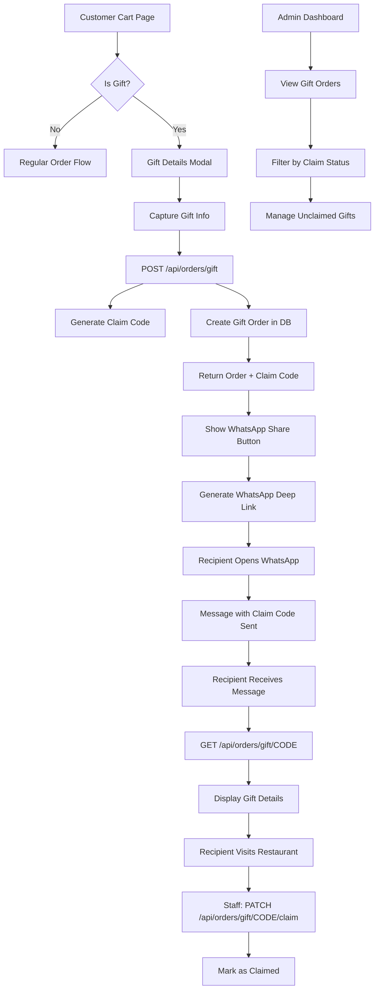
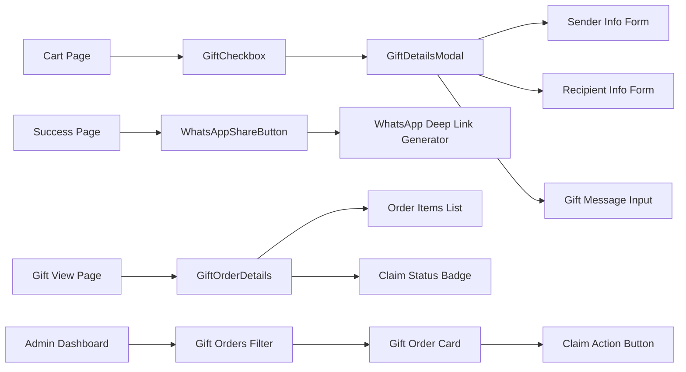

# Design Document: Send to Friend Gift Order System

## Overview

The Send to Friend Gift Order System enables customers to purchase food orders and send them as gifts to friends or family members via WhatsApp. The system generates unique claim codes, manages gift order lifecycle, and provides administrative oversight. This design addresses database schema changes, API endpoints, UI components, WhatsApp integration, and ensures safe migration practices.

### Key Design Goals

1. **Safe Database Migration**: Test all schema changes locally before production deployment
2. **Secure Claim Codes**: Cryptographically secure, unique identifiers for gift redemption
3. **Seamless WhatsApp Integration**: Pre-filled messages with deep linking for mobile/desktop
4. **Complete Gift Lifecycle**: Creation → Sharing → Viewing → Claiming → Fulfillment
5. **Admin Visibility**: Clear gift order tracking and management
6. **Data Integrity**: Round-trip serialization and validation

### Technical Context

- **Framework**: Next.js 14 (App Router)
- **Database**: PostgreSQL with Prisma ORM
- **State Management**: React hooks for UI state
- **Validation**: Zod schemas for API requests
- **Security**: Crypto module for claim code generation
- **Integration**: WhatsApp URL scheme for sharing

## Architecture

### High-Level System Architecture



### Component Architecture



### Data Flow Architecture

```
Customer Checkout
    ↓
Gift Option Selected
    ↓
Gift Details Captured ──→ Validation (Zod Schema)
    ↓                           ↓
API: Create Gift Order ←─── Validated Data
    ↓
Generate Claim Code (crypto.randomBytes)
    ↓
Verify Uniqueness (DB Query)
    ↓
Store in Database (Prisma Transaction)
    ↓
Return Order + Claim Code
    ↓
Generate WhatsApp Message
    ↓
Share via WhatsApp Deep Link
    ↓
Recipient Views (Public API)
    ↓
Staff Claims (Admin API)
    ↓
Update Order Status
```

## Database Schema

### Order Model Extensions

**New Fields to Add:**

```prisma
model Order {
  // ... existing fields ...
  
  // Gift Order Fields
  isGift                Boolean   @default(false)
  giftSenderName        String?
  giftSenderPhone       String?
  giftRecipientName     String?
  giftRecipientPhone    String?
  giftMessage           String?   @db.Text
  giftClaimCode         String?   @unique
  giftClaimed           Boolean   @default(false)
  giftClaimedAt         DateTime?
  
  @@index([giftClaimCode])
  @@index([isGift, giftClaimed])
}
```

### Migration Strategy

**Step 1: Create Migration File**
```bash
npx prisma migrate dev --name add_gift_order_fields --create-only
```

**Step 2: Review Generated Migration**
```sql
-- Migration: add_gift_order_fields
ALTER TABLE "Order" ADD COLUMN "isGift" BOOLEAN NOT NULL DEFAULT false;
ALTER TABLE "Order" ADD COLUMN "giftSenderName" TEXT;
ALTER TABLE "Order" ADD COLUMN "giftSenderPhone" TEXT;
ALTER TABLE "Order" ADD COLUMN "giftRecipientName" TEXT;
ALTER TABLE "Order" ADD COLUMN "giftRecipientPhone" TEXT;
ALTER TABLE "Order" ADD COLUMN "giftMessage" TEXT;
ALTER TABLE "Order" ADD COLUMN "giftClaimCode" TEXT;
ALTER TABLE "Order" ADD COLUMN "giftClaimed" BOOLEAN NOT NULL DEFAULT false;
ALTER TABLE "Order" ADD COLUMN "giftClaimedAt" TIMESTAMP(3);

CREATE UNIQUE INDEX "Order_giftClaimCode_key" ON "Order"("giftClaimCode");
CREATE INDEX "Order_giftClaimCode_idx" ON "Order"("giftClaimCode");
CREATE INDEX "Order_isGift_giftClaimed_idx" ON "Order"("isGift", "giftClaimed");
```

**Step 3: Test Locally**
1. Backup local database
2. Run migration: `npx prisma migrate dev`
3. Verify schema: `npx prisma studio`
4. Test with seed data
5. Test rollback if needed

**Step 4: Deploy to Production**
1. Create database backup
2. Run migration: `npx prisma migrate deploy`
3. Verify with test order
4. Monitor for errors

### Data Model Relationships

```typescript
// Extended Order type with gift fields
interface Order {
  // Existing fields
  id: string;
  orderNumber: string;
  status: OrderStatus;
  total: number;
  createdAt: Date;
  // ... other existing fields
  
  // Gift order fields
  isGift: boolean;
  giftSenderName: string | null;
  giftSenderPhone: string | null;
  giftRecipientName: string | null;
  giftRecipientPhone: string | null;
  giftMessage: string | null;
  giftClaimCode: string | null;
  giftClaimed: boolean;
  giftClaimedAt: Date | null;
}
```

## Claim Code Generation

### Algorithm

**Requirements:**
- Cryptographically secure random generation
- 8-12 characters long
- Alphanumeric only (A-Z, 0-9)
- Guaranteed uniqueness

**Implementation:**

```typescript
import crypto from 'crypto';
import { prisma } from '@/lib/prisma';

/**
 * Generate a cryptographically secure unique claim code
 * Property: Generated code is unique across all orders
 */
export async function generateClaimCode(): Promise<string> {
  const LENGTH = 10;
  const CHARSET = 'ABCDEFGHJKLMNPQRSTUVWXYZ23456789'; // Excluded ambiguous: I,O,0,1
  const MAX_ATTEMPTS = 10;
  
  for (let attempt = 0; attempt < MAX_ATTEMPTS; attempt++) {
    // Generate random bytes
    const bytes = crypto.randomBytes(LENGTH);
    
    // Convert to alphanumeric string
    let code = '';
    for (let i = 0; i < LENGTH; i++) {
      code += CHARSET[bytes[i] % CHARSET.length];
    }
    
    // Verify uniqueness
    const existing = await prisma.order.findUnique({
      where: { giftClaimCode: code },
      select: { id: true },
    });
    
    if (!existing) {
      return code;
    }
  }
  
  throw new Error('Failed to generate unique claim code after maximum attempts');
}

/**
 * Validate claim code format
 */
export function isValidClaimCode(code: string): boolean {
  return /^[A-Z0-9]{8,12}$/.test(code);
}
```

### Correctness Property

**Property 1: Claim Code Uniqueness**
```typescript
// FOR ALL valid claim codes generated by generateClaimCode(),
// THERE EXISTS exactly zero or one Order with that giftClaimCode

describe('Claim Code Generation Property', () => {
  it('generates unique claim codes', async () => {
    const codes = new Set<string>();
    
    // Generate 100 claim codes
    for (let i = 0; i < 100; i++) {
      const code = await generateClaimCode();
      
      // Property: code should not exist in set (uniqueness)
      expect(codes.has(code)).toBe(false);
      codes.add(code);
      
      // Property: code should match format
      expect(isValidClaimCode(code)).toBe(true);
    }
  });
});
```

## API Endpoints

### 1. Create Gift Order

**Endpoint:** `POST /api/orders/gift`

**Request Schema:**
```typescript
const createGiftOrderSchema = z.object({
  branchId: z.string().uuid(),
  tableId: z.string().uuid(),
  
  // Gift information
  giftSenderName: z.string().min(1).max(100),
  giftSenderPhone: z.string().regex(/^\+?[0-9]{10,15}$/),
  giftRecipientName: z.string().min(1).max(100),
  giftRecipientPhone: z.string().regex(/^\+?[0-9]{10,15}$/),
  giftMessage: z.string().max(500).optional(),
  
  // Order items
  items: z.array(z.object({
    menuItemId: z.string().uuid(),
    quantity: z.number().int().min(1).max(99),
    variantId: z.string().uuid().optional(),
    optionValueIds: z.array(z.string().uuid()).optional(),
  })).min(1),
});

type CreateGiftOrderRequest = z.infer<typeof createGiftOrderSchema>;
```

**Response Schema:**
```typescript
interface CreateGiftOrderResponse {
  success: true;
  order: {
    id: string;
    orderNumber: string;
    giftClaimCode: string;
    total: number;
    createdAt: string;
  };
  whatsappMessage: string; // Pre-formatted message
  whatsappLink: string; // Deep link URL
}
```

**Implementation:**
```typescript
// src/app/api/orders/gift/route.ts
export async function POST(request: Request) {
  try {
    const body = await request.json();
    const data = createGiftOrderSchema.parse(body);
    
    // Generate claim code
    const claimCode = await generateClaimCode();
    
    // Create order with gift fields
    const order = await orderService.createGiftOrder({
      ...data,
      giftClaimCode: claimCode,
      isGift: true,
    });
    
    // Generate WhatsApp message
    const message = formatWhatsAppMessage(order);
    const link = generateWhatsAppLink(data.giftRecipientPhone, message);
    
    return NextResponse.json({
      success: true,
      order: {
        id: order.id,
        orderNumber: order.orderNumber,
        giftClaimCode: claimCode,
        total: order.total,
        createdAt: order.createdAt.toISOString(),
      },
      whatsappMessage: message,
      whatsappLink: link,
    }, { status: 201 });
    
  } catch (error) {
    if (error instanceof z.ZodError) {
      return NextResponse.json(
        { error: 'Validation error', details: error.errors },
        { status: 400 }
      );
    }
    
    console.error('Gift order creation error:', error);
    return NextResponse.json(
      { error: 'Failed to create gift order' },
      { status: 500 }
    );
  }
}
```

### 2. View Gift Order by Claim Code

**Endpoint:** `GET /api/orders/gift/[code]`

**Request:** No body (claim code in URL)

**Response Schema:**
```typescript
interface ViewGiftOrderResponse {
  success: true;
  gift: {
    orderNumber: string;
    senderName: string;
    recipientName: string;
    message: string | null;
    total: number;
    items: Array<{
      name: string;
      quantity: number;
      price: number;
    }>;
    claimed: boolean;
    claimedAt: string | null;
    branch: {
      name: string;
      address: string;
      phone: string;
    };
    createdAt: string;
  };
}
```

**Implementation:**
```typescript
// src/app/api/orders/gift/[code]/route.ts
export async function GET(
  request: Request,
  { params }: { params: { code: string } }
) {
  try {
    const { code } = params;
    
    // Validate code format
    if (!isValidClaimCode(code)) {
      return NextResponse.json(
        { error: 'Invalid claim code format' },
        { status: 400 }
      );
    }
    
    // Fetch gift order
    const order = await prisma.order.findUnique({
      where: { giftClaimCode: code },
      include: {
        items: {
          include: {
            menuItem: true,
            variant: { include: { variant: true } },
          },
        },
        branch: {
          include: { restaurant: true },
        },
      },
    });
    
    if (!order || !order.isGift) {
      return NextResponse.json(
        { error: 'Gift order not found' },
        { status: 404 }
      );
    }
    
    return NextResponse.json({
      success: true,
      gift: {
        orderNumber: order.orderNumber,
        senderName: order.giftSenderName!,
        recipientName: order.giftRecipientName!,
        message: order.giftMessage,
        total: order.total,
        items: order.items.map(item => ({
          name: item.menuItem.name,
          quantity: item.quantity,
          price: item.subtotal,
        })),
        claimed: order.giftClaimed,
        claimedAt: order.giftClaimedAt?.toISOString() ?? null,
        branch: {
          name: order.branch.name,
          address: order.branch.address,
          phone: order.branch.phone,
        },
        createdAt: order.createdAt.toISOString(),
      },
    });
    
  } catch (error) {
    console.error('Gift order view error:', error);
    return NextResponse.json(
      { error: 'Failed to retrieve gift order' },
      { status: 500 }
    );
  }
}
```

### 3. Claim Gift Order

**Endpoint:** `PATCH /api/orders/gift/[code]/claim`

**Request Schema:**
```typescript
const claimGiftOrderSchema = z.object({
  staffId: z.string().uuid().optional(), // For tracking who claimed
});
```

**Response Schema:**
```typescript
interface ClaimGiftOrderResponse {
  success: true;
  order: {
    id: string;
    orderNumber: string;
    claimed: true;
    claimedAt: string;
  };
}
```

**Implementation:**
```typescript
// src/app/api/orders/gift/[code]/claim/route.ts
export async function PATCH(
  request: Request,
  { params }: { params: { code: string } }
) {
  try {
    const { code } = params;
    
    if (!isValidClaimCode(code)) {
      return NextResponse.json(
        { error: 'Invalid claim code format' },
        { status: 400 }
      );
    }
    
    // Update order as claimed
    const order = await prisma.order.update({
      where: { giftClaimCode: code },
      data: {
        giftClaimed: true,
        giftClaimedAt: new Date(),
      },
      select: {
        id: true,
        orderNumber: true,
        giftClaimed: true,
        giftClaimedAt: true,
      },
    });
    
    return NextResponse.json({
      success: true,
      order: {
        id: order.id,
        orderNumber: order.orderNumber,
        claimed: order.giftClaimed,
        claimedAt: order.giftClaimedAt!.toISOString(),
      },
    });
    
  } catch (error) {
    if (error.code === 'P2025') {
      return NextResponse.json(
        { error: 'Gift order not found' },
        { status: 404 }
      );
    }
    
    console.error('Gift order claim error:', error);
    return NextResponse.json(
      { error: 'Failed to claim gift order' },
      { status: 500 }
    );
  }
}
```

## WhatsApp Integration

### Deep Link Generation

**WhatsApp URL Scheme:**
```
whatsapp://send?phone={phone}&text={encoded_message}  // Mobile
https://wa.me/{phone}?text={encoded_message}          // Web/Desktop
```

**Implementation:**
```typescript
/**
 * Generate WhatsApp deep link
 */
export function generateWhatsAppLink(phone: string, message: string): string {
  // Remove non-digits from phone
  const cleanPhone = phone.replace(/\D/g, '');
  
  // URL encode message
  const encodedMessage = encodeURIComponent(message);
  
  // Use wa.me for universal compatibility
  return `https://wa.me/${cleanPhone}?text=${encodedMessage}`;
}

/**
 * Format WhatsApp message for gift order
 */
export function formatWhatsAppMessage(order: GiftOrder): string {
  const lines = [
    `🎁 *You've Received a Food Gift!*`,
    ``,
    `From: *${order.giftSenderName}*`,
    `To: *${order.giftRecipientName}*`,
    ``,
  ];
  
  if (order.giftMessage) {
    lines.push(`💌 Message: "${order.giftMessage}"`);
    lines.push(``);
  }
  
  lines.push(`📦 *Your Order:*`);
  order.items.forEach(item => {
    lines.push(`  • ${item.quantity}x ${item.name}`);
  });
  
  lines.push(``);
  lines.push(`💰 Total Value: ₦${(order.total / 100).toFixed(2)}`);
  lines.push(``);
  lines.push(`🔑 *Claim Code:* ${order.giftClaimCode}`);
  lines.push(``);
  lines.push(`📍 *Pickup Location:*`);
  lines.push(`${order.branch.restaurant.name} - ${order.branch.name}`);
  lines.push(`${order.branch.address}`);
  lines.push(`📞 ${order.branch.phone}`);
  lines.push(``);
  lines.push(`To claim your gift, visit the restaurant and provide the claim code above!`);
  
  return lines.join('\n');
}
```

### Message Template

**Example Formatted Message:**
```
🎁 *You've Received a Food Gift!*

From: *John Doe*
To: *Jane Smith*

💌 Message: "Happy Birthday! Enjoy a delicious meal on me!"

📦 *Your Order:*
  • 1x Jollof Rice with Chicken
  • 2x Plantain
  • 1x Chapman

💰 Total Value: ₦3,500.00

🔑 *Claim Code:* A7K9P2M5N8

📍 *Pickup Location:*
Great Delight - Main Branch
123 Lagos Street, Victoria Island
📞 +234 123 456 7890

To claim your gift, visit the restaurant and provide the claim code above!
```

## UI Components

### 1. GiftCheckbox Component

**Location:** `src/components/gift/GiftCheckbox.tsx`

**Purpose:** Toggle to enable gift order mode

```typescript
'use client';

interface GiftCheckboxProps {
  checked: boolean;
  onChange: (checked: boolean) => void;
}

export function GiftCheckbox({ checked, onChange }: GiftCheckboxProps) {
  return (
    <div className="flex items-center gap-3 p-4 border-2 border-dashed border-purple-300 rounded-xl bg-purple-50 dark:bg-purple-900/20">
      <input
        type="checkbox"
        id="gift-order"
        checked={checked}
        onChange={(e) => onChange(e.target.checked)}
        className="w-5 h-5 rounded border-purple-400 text-purple-600 focus:ring-purple-500"
      />
      <label htmlFor="gift-order" className="flex-1 cursor-pointer">
        <div className="flex items-center gap-2">
          <span className="text-2xl">🎁</span>
          <div>
            <div className="font-bold text-gray-900 dark:text-gray-100">
              Send as a Gift
            </div>
            <div className="text-sm text-gray-600 dark:text-gray-400">
              Send this order to a friend via WhatsApp
            </div>
          </div>
        </div>
      </label>
    </div>
  );
}
```

### 2. GiftDetailsModal Component

**Location:** `src/components/gift/GiftDetailsModal.tsx`

**Purpose:** Capture gift sender, recipient, and message

```typescript
'use client';

import { useState } from 'react';
import { X } from 'lucide-react';

interface GiftDetails {
  senderName: string;
  senderPhone: string;
  recipientName: string;
  recipientPhone: string;
  message: string;
}

interface GiftDetailsModalProps {
  isOpen: boolean;
  onClose: () => void;
  onSubmit: (details: GiftDetails) => void;
}

export function GiftDetailsModal({ isOpen, onClose, onSubmit }: GiftDetailsModalProps) {
  const [details, setDetails] = useState<GiftDetails>({
    senderName: '',
    senderPhone: '',
    recipientName: '',
    recipientPhone: '',
    message: '',
  });
  
  const handleSubmit = (e: React.FormEvent) => {
    e.preventDefault();
    onSubmit(details);
  };
  
  if (!isOpen) return null;
  
  return (
    <div className="fixed inset-0 z-50 flex items-center justify-center bg-black/50">
      <div className="bg-white dark:bg-gray-800 rounded-2xl shadow-2xl max-w-lg w-full mx-4 max-h-[90vh] overflow-y-auto">
        {/* Header */}
        <div className="flex items-center justify-between p-6 border-b border-gray-200 dark:border-gray-700">
          <h2 className="text-2xl font-bold text-gray-900 dark:text-gray-100 flex items-center gap-2">
            <span>🎁</span> Gift Details
          </h2>
          <button
            onClick={onClose}
            className="p-2 hover:bg-gray-100 dark:hover:bg-gray-700 rounded-lg transition-colors"
          >
            <X className="w-5 h-5" />
          </button>
        </div>
        
        {/* Form */}
        <form onSubmit={handleSubmit} className="p-6 space-y-6">
          {/* Sender Information */}
          <div className="space-y-4">
            <h3 className="font-semibold text-gray-900 dark:text-gray-100">Your Information</h3>
            
            <div>
              <label className="block text-sm font-medium text-gray-700 dark:text-gray-300 mb-2">
                Your Name <span className="text-red-600">*</span>
              </label>
              <input
                type="text"
                required
                value={details.senderName}
                onChange={(e) => setDetails({ ...details, senderName: e.target.value })}
                className="w-full px-4 py-3 border border-gray-300 rounded-lg focus:ring-2 focus:ring-purple-500"
                placeholder="John Doe"
              />
            </div>
            
            <div>
              <label className="block text-sm font-medium text-gray-700 dark:text-gray-300 mb-2">
                Your Phone <span className="text-red-600">*</span>
              </label>
              <input
                type="tel"
                required
                value={details.senderPhone}
                onChange={(e) => setDetails({ ...details, senderPhone: e.target.value })}
                className="w-full px-4 py-3 border border-gray-300 rounded-lg focus:ring-2 focus:ring-purple-500"
                placeholder="+234 XXX XXX XXXX"
              />
            </div>
          </div>
          
          {/* Recipient Information */}
          <div className="space-y-4">
            <h3 className="font-semibold text-gray-900 dark:text-gray-100">Recipient Information</h3>
            
            <div>
              <label className="block text-sm font-medium text-gray-700 dark:text-gray-300 mb-2">
                Recipient Name <span className="text-red-600">*</span>
              </label>
              <input
                type="text"
                required
                value={details.recipientName}
                onChange={(e) => setDetails({ ...details, recipientName: e.target.value })}
                className="w-full px-4 py-3 border border-gray-300 rounded-lg focus:ring-2 focus:ring-purple-500"
                placeholder="Jane Smith"
              />
            </div>
            
            <div>
              <label className="block text-sm font-medium text-gray-700 dark:text-gray-300 mb-2">
                Recipient Phone <span className="text-red-600">*</span>
              </label>
              <input
                type="tel"
                required
                value={details.recipientPhone}
                onChange={(e) => setDetails({ ...details, recipientPhone: e.target.value })}
                className="w-full px-4 py-3 border border-gray-300 rounded-lg focus:ring-2 focus:ring-purple-500"
                placeholder="+234 XXX XXX XXXX"
              />
            </div>
          </div>
          
          {/* Gift Message */}
          <div>
            <label className="block text-sm font-medium text-gray-700 dark:text-gray-300 mb-2">
              Gift Message (Optional)
            </label>
            <textarea
              value={details.message}
              onChange={(e) => setDetails({ ...details, message: e.target.value })}
              rows={3}
              maxLength={500}
              className="w-full px-4 py-3 border border-gray-300 rounded-lg focus:ring-2 focus:ring-purple-500 resize-none"
              placeholder="Happy Birthday! Enjoy this meal..."
            />
            <div className="text-sm text-gray-500 text-right mt-1">
              {details.message.length}/500
            </div>
          </div>
          
          {/* Submit Button */}
          <button
            type="submit"
            className="w-full bg-gradient-to-r from-purple-600 to-pink-600 hover:from-purple-700 hover:to-pink-700 text-white font-bold py-4 px-6 rounded-xl shadow-lg hover:shadow-xl transition-all duration-200"
          >
            Continue to Checkout
          </button>
        </form>
      </div>
    </div>
  );
}
```

### 3. WhatsAppShareButton Component

**Location:** `src/components/gift/WhatsAppShareButton.tsx`

**Purpose:** Share gift order via WhatsApp

```typescript
'use client';

import { MessageCircle } from 'lucide-react';

interface WhatsAppShareButtonProps {
  whatsappLink: string;
  recipientName: string;
}

export function WhatsAppShareButton({ whatsappLink, recipientName }: WhatsAppShareButtonProps) {
  const handleShare = () => {
    // Open WhatsApp link
    window.open(whatsappLink, '_blank');
  };
  
  return (
    <button
      onClick={handleShare}
      className="w-full bg-green-500 hover:bg-green-600 text-white font-bold py-4 px-6 rounded-xl shadow-lg hover:shadow-xl transition-all duration-200 flex items-center justify-center gap-3"
    >
      <MessageCircle className="w-6 h-6" />
      <span>Send Gift to {recipientName} via WhatsApp</span>
    </button>
  );
}
```

### 4. GiftOrderView Component

**Location:** `src/app/gift/[code]/page.tsx`

**Purpose:** Public page for recipients to view gift details

```typescript
import { notFound } from 'next/navigation';

export default async function GiftOrderViewPage({
  params,
}: {
  params: { code: string };
}) {
  // Fetch gift order
  const response = await fetch(
    `${process.env.NEXT_PUBLIC_BASE_URL}/api/orders/gift/${params.code}`,
    { cache: 'no-store' }
  );
  
  if (!response.ok) {
    notFound();
  }
  
  const { gift } = await response.json();
  
  return (
    <div className="min-h-screen bg-gradient-to-br from-purple-50 via-pink-50 to-red-50 p-4">
      <div className="max-w-2xl mx-auto pt-12">
        {/* Gift Header */}
        <div className="text-center mb-8">
          <div className="text-6xl mb-4">🎁</div>
          <h1 className="text-4xl font-bold text-gray-900 mb-2">
            You've Received a Gift!
          </h1>
          <p className="text-xl text-gray-600">
            From <strong>{gift.senderName}</strong> to <strong>{gift.recipientName}</strong>
          </p>
        </div>
        
        {/* Gift Message */}
        {gift.message && (
          <div className="bg-white rounded-2xl shadow-lg p-6 mb-6">
            <div className="text-sm text-gray-600 mb-2">💌 Personal Message:</div>
            <div className="text-lg italic text-gray-800">"{gift.message}"</div>
          </div>
        )}
        
        {/* Order Details */}
        <div className="bg-white rounded-2xl shadow-lg p-6 mb-6">
          <h2 className="text-xl font-bold mb-4">Your Order</h2>
          <div className="space-y-3">
            {gift.items.map((item, index) => (
              <div key={index} className="flex justify-between">
                <span>{item.quantity}x {item.name}</span>
                <span className="font-semibold">₦{(item.price / 100).toFixed(2)}</span>
              </div>
            ))}
          </div>
          <div className="border-t border-gray-200 mt-4 pt-4">
            <div className="flex justify-between text-xl font-bold">
              <span>Total Value</span>
              <span>₦{(gift.total / 100).toFixed(2)}</span>
            </div>
          </div>
        </div>
        
        {/* Claim Status */}
        <div className="bg-white rounded-2xl shadow-lg p-6 mb-6">
          <h2 className="text-xl font-bold mb-4">Claim Information</h2>
          {gift.claimed ? (
            <div className="bg-green-50 border-2 border-green-500 rounded-xl p-4">
              <div className="text-green-800 font-bold">✓ Already Claimed</div>
              <div className="text-sm text-green-600">
                Claimed on {new Date(gift.claimedAt).toLocaleDateString()}
              </div>
            </div>
          ) : (
            <div className="bg-purple-50 border-2 border-purple-500 rounded-xl p-4">
              <div className="text-purple-800 font-bold">Ready to Claim!</div>
              <div className="text-sm text-purple-600">
                Visit the restaurant and show this code to staff
              </div>
            </div>
          )}
        </div>
        
        {/* Pickup Location */}
        <div className="bg-white rounded-2xl shadow-lg p-6">
          <h2 className="text-xl font-bold mb-4">📍 Pickup Location</h2>
          <div className="space-y-2">
            <div className="font-semibold">{gift.branch.name}</div>
            <div className="text-gray-600">{gift.branch.address}</div>
            <div className="text-gray-600">📞 {gift.branch.phone}</div>
          </div>
        </div>
      </div>
    </div>
  );
}
```

## Admin Dashboard Integration

### Gift Order Filtering

**Location:** `src/app/admin/orders/OrdersClient.tsx`

**Enhancements:**
1. Add filter toggle for gift orders
2. Display gift badge on order cards
3. Show claim status
4. Add claim action button

```typescript
// Filter state
const [showOnlyGifts, setShowOnlyGifts] = useState(false);

// Filtered orders
const filteredOrders = orders.filter(order => {
  if (showOnlyGifts) {
    return order.isGift;
  }
  return true;
});

// Gift badge component
function GiftBadge({ order }: { order: Order }) {
  if (!order.isGift) return null;
  
  return (
    <div className="flex items-center gap-2">
      <span className="bg-purple-100 text-purple-800 px-3 py-1 rounded-full text-sm font-semibold">
        🎁 Gift Order
      </span>
      {order.giftClaimed ? (
        <span className="bg-green-100 text-green-800 px-3 py-1 rounded-full text-sm">
          ✓ Claimed
        </span>
      ) : (
        <span className="bg-yellow-100 text-yellow-800 px-3 py-1 rounded-full text-sm">
          Unclaimed
        </span>
      )}
    </div>
  );
}
```

## Correctness Properties and Testing

### Property 1: Claim Code Uniqueness

**Property:** All generated claim codes are unique across the system.

**Test:**
```typescript
import { fc } from 'fast-check';

describe('Claim Code Uniqueness Property', () => {
  it('generates unique codes across multiple calls', async () => {
    await fc.assert(
      fc.asyncProperty(
        fc.integer({ min: 10, max: 100 }),
        async (count) => {
          const codes = new Set<string>();
          
          for (let i = 0; i < count; i++) {
            const code = await generateClaimCode();
            
            // Property: code should not exist in set
            if (codes.has(code)) {
              return false;
            }
            
            codes.add(code);
          }
          
          // All codes were unique
          return codes.size === count;
        }
      )
    );
  });
});
```

### Property 2: Parser/Serializer Round-Trip

**Property:** Parsing a serialized gift order and then serializing the result produces equivalent output.

**Test:**
```typescript
describe('Gift Order Serialization Round-Trip Property', () => {
  it('maintains data integrity through parse and serialize cycles', () => {
    fc.assert(
      fc.property(
        giftOrderArbitrary(),
        (giftOrder) => {
          // Serialize
          const serialized = JSON.stringify(giftOrder);
          
          // Parse
          const parsed = JSON.parse(serialized);
          
          // Serialize again
          const reSerialized = JSON.stringify(parsed);
          
          // Property: serialized === reSerialized (round-trip)
          return serialized === reSerialized;
        }
      )
    );
  });
});

// Arbitrary generator for gift orders
function giftOrderArbitrary() {
  return fc.record({
    isGift: fc.constant(true),
    giftSenderName: fc.string({ minLength: 1, maxLength: 100 }),
    giftSenderPhone: fc.string({ minLength: 10, maxLength: 15 }),
    giftRecipientName: fc.string({ minLength: 1, maxLength: 100 }),
    giftRecipientPhone: fc.string({ minLength: 10, maxLength: 15 }),
    giftMessage: fc.option(fc.string({ maxLength: 500 }), { nil: null }),
    giftClaimCode: fc.string({ minLength: 8, maxLength: 12 }),
    giftClaimed: fc.boolean(),
    giftClaimedAt: fc.option(fc.date(), { nil: null }),
  });
}
```

### Property 3: Gift Order State Transitions

**Property:** Gift order claim status transitions are valid and monotonic.

**Test:**
```typescript
describe('Gift Order State Transition Property', () => {
  it('claim status transitions are valid', () => {
    fc.assert(
      fc.property(
        fc.array(fc.boolean(), { minLength: 1, maxLength: 10 }),
        (actions) => {
          let claimed = false;
          let claimedAt: Date | null = null;
          
          for (const shouldClaim of actions) {
            if (shouldClaim && !claimed) {
              // Transition: unclaimed → claimed
              claimed = true;
              claimedAt = new Date();
            }
            
            // Property: once claimed, always claimed
            if (claimed) {
              if (!claimed || !claimedAt) {
                return false; // Invalid state
              }
            }
          }
          
          return true;
        }
      )
    );
  });
});
```

### Property 4: WhatsApp Link Generation

**Property:** Generated WhatsApp links are valid URLs with proper encoding.

**Test:**
```typescript
describe('WhatsApp Link Generation Property', () => {
  it('generates valid WhatsApp URLs', () => {
    fc.assert(
      fc.property(
        fc.string({ minLength: 10, maxLength: 15 }),
        fc.string({ minLength: 1, maxLength: 1000 }),
        (phone, message) => {
          const link = generateWhatsAppLink(phone, message);
          
          // Property: link starts with https://wa.me/
          if (!link.startsWith('https://wa.me/')) {
            return false;
          }
          
          // Property: link is a valid URL
          try {
            new URL(link);
            return true;
          } catch {
            return false;
          }
        }
      )
    );
  });
});
```

## Error Handling

### Validation Errors

1. **Invalid phone format**: Return 400 with error message
2. **Missing required fields**: Return 400 with field details
3. **Message too long**: Return 400 with length constraint
4. **Invalid claim code format**: Return 400 with format requirements

### Database Errors

1. **Duplicate claim code** (should never happen): Retry generation
2. **Order not found**: Return 404
3. **Already claimed**: Return current claim status (idempotent)
4. **Connection failure**: Return 500 with retry suggestion

### Migration Errors

1. **Schema mismatch**: Rollback migration
2. **Data loss**: Restore from backup
3. **Index creation failure**: Manual index creation

## Security Considerations

1. **Input Sanitization**: All text inputs sanitized to prevent XSS
2. **Phone Validation**: Regex validation prevents injection
3. **Claim Code Validation**: Alphanumeric only, prevents path traversal
4. **Rate Limiting**: Limit gift order creation to prevent abuse
5. **Public Access**: Gift view endpoint is public but read-only
6. **Admin Access**: Claim endpoint requires authentication

## Deployment Checklist

- [ ] Create local database backup
- [ ] Test migration on local database
- [ ] Verify seed data still works
- [ ] Test gift order creation locally
- [ ] Test WhatsApp link generation
- [ ] Test claim code uniqueness
- [ ] Run all property-based tests
- [ ] Create production database backup
- [ ] Run migration on production
- [ ] Verify with test gift order
- [ ] Monitor error logs
- [ ] Test WhatsApp sharing on mobile
- [ ] Test gift view page
- [ ] Test admin claim functionality

## Summary

The Send to Friend Gift Order System provides a complete gift ordering experience with:

- **Secure claim codes** generated with cryptographic randomness
- **Seamless WhatsApp integration** with deep linking
- **Complete gift lifecycle** from creation to claiming
- **Safe database migration** with local testing first
- **Comprehensive validation** and error handling
- **Property-based testing** for critical invariants

The design ensures data integrity, security, and a delightful user experience for both gift senders and recipients.
